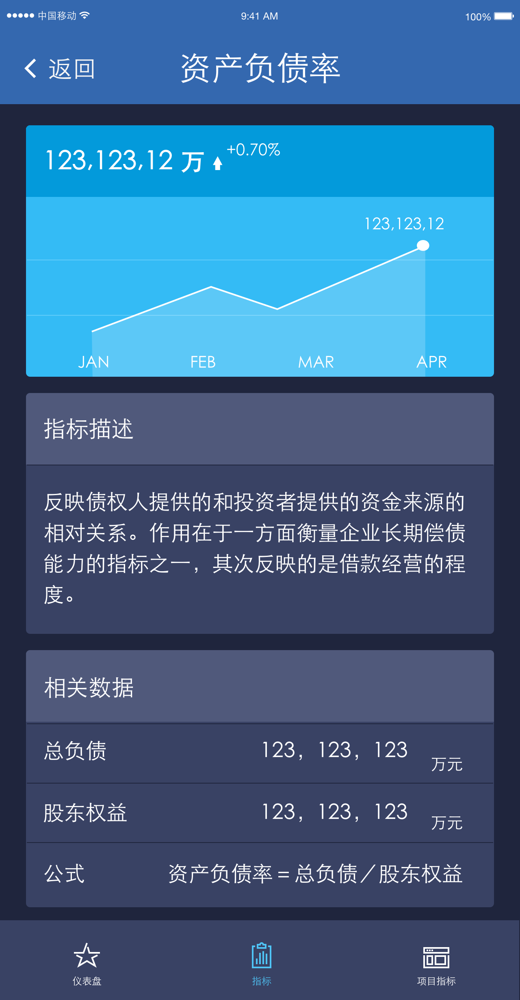

<a name="top"></a>
### API 列表

URL | HTTP | 说明 | UI 图
----|------|-----|-----
[/users/signin](#signin) 	| POST | 用户登陆 | [登陆页面](#signin_pic)
[/incomes](#incomes) 		| GET  | 首页收入总览 | [收入页面](#incomes_pic)
[/profits](#profits) 		| GET  | 首页利润总览 | [利润页面](#profits_pic)
[/indexes/rates](#rates) 	| GET  | 指标列表 | [指标列表页面](#rates_pic)
[/indexes/rate](#rate) 		| GET  | 指标详情 | [指标详情页面](#rate_pic)
        
<br>
> ### 统一错误返回

```
{
	success:false,
	error_code:'400',
	error_msg:'某某错误'
}
```

> ### 统一Header设置 (request)

```
{
	token:'',	// 由 /users/signin 返回
	sign:''
}
```
<br>

<a name="signin"></a>
## 1. /users/signin
[登陆页面](#signin_pic)
### 请求

```
{
	name:'',
	password:'',
	sign:''
}

```

### 返回

```
{
	success:true,
	token:''
}

```
<br>

<a name="incomes"></a>
## 2. /incomes
[收入页面](#incomes_pic)
### 请求

```
no params
```

### 返回

```
{
	success:true,
	result: {
		MTD: {
			items:[
				{
					name: '尚融本部',
					value: 234423
				},
				{
					name: '海平线',
					value: 234423
				},
				{
					name: '广州钢铁',
					value: 234423
				},
				{
					name: '营业外',
					value: 234423
				},
			],
			total: '102,230',
			month: 'Aug',
			completion: '80%',
			mom: '10%',	// MTD只显示环比
		},
		YTD: {
			... // 同上MTD
			yoy: '12%',	// YTD只显示同比
		}
	}
}

```
<br>

<a name="profits"></a>
## 3. /profits
[利润页面](#profits_pic)
### 请求

```
no params

```

### 返回

```
{
	success:true,
	result: {
		MTD: {
			items:[
				{
					name: '尚融本部',
					value: 234423
				},
				{
					name: '海平线',
					value: 234423
				},
				{
					name: '广州钢铁',
					value: 234423
				},
				{
					name: '营业外',
					value: 234423
				},
			],
			total: '102,230',
			month: 'Aug',
			completion: '80%',
			mom: '10%',	// MTD只显示环比
		},
		YTD: {
			... // 同上MTD
			yoy: '12%',	// YTD只显示同比
		}
	}
}

```
<br>

<a name="rates"></a>
## 4. /rates
[指标列表页面](#rates_pic)
### 请求

```
{
	group_id:'1', // 1: 财务类，2: 运营类， 3: 发展类， 4: 平台类， 5: 风控类
}

```

### 返回

```
{
	success:true,
	result: {
		rates:[	// 指标列表
			{id:'11', name:'资产负债率'}，
			{id:'12', name:'产权比率'}，
			{id:'13', name:'资金周转率'}，
			{id:'14', name:'资金收益率'}，
		]
	}
}

```
<br>

<a name="rate"></a>
## 5. /rate	
[指标详情页面](#rate_pic)
### 请求

```
{
	rate_id:'11',
}

```

### 返回

```
{
	success:true,
	result: {
		info: {
			// section 1
			// section 2
			// section 3			
		}
	}
}

```

### [返回顶部](#top)
<br>
---
<br>
<a name="signin_pic"></a>
### 登陆页面


<a name="incomes_pic"></a>
### 收入页面


<a name="profits_pic"></a>
### 利润页面


<a name="rates_pic"></a>
### 指标列表页面


<a name="rate_pic"></a>
### 指标详情页面1

### 指标详情页面2

### 指标详情页面3



### [返回顶部](#top)

